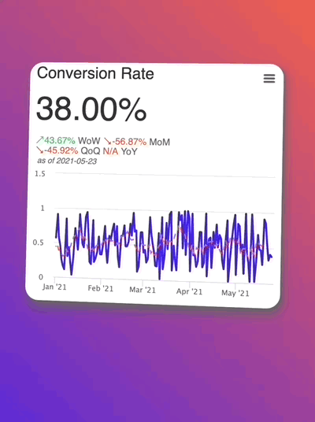
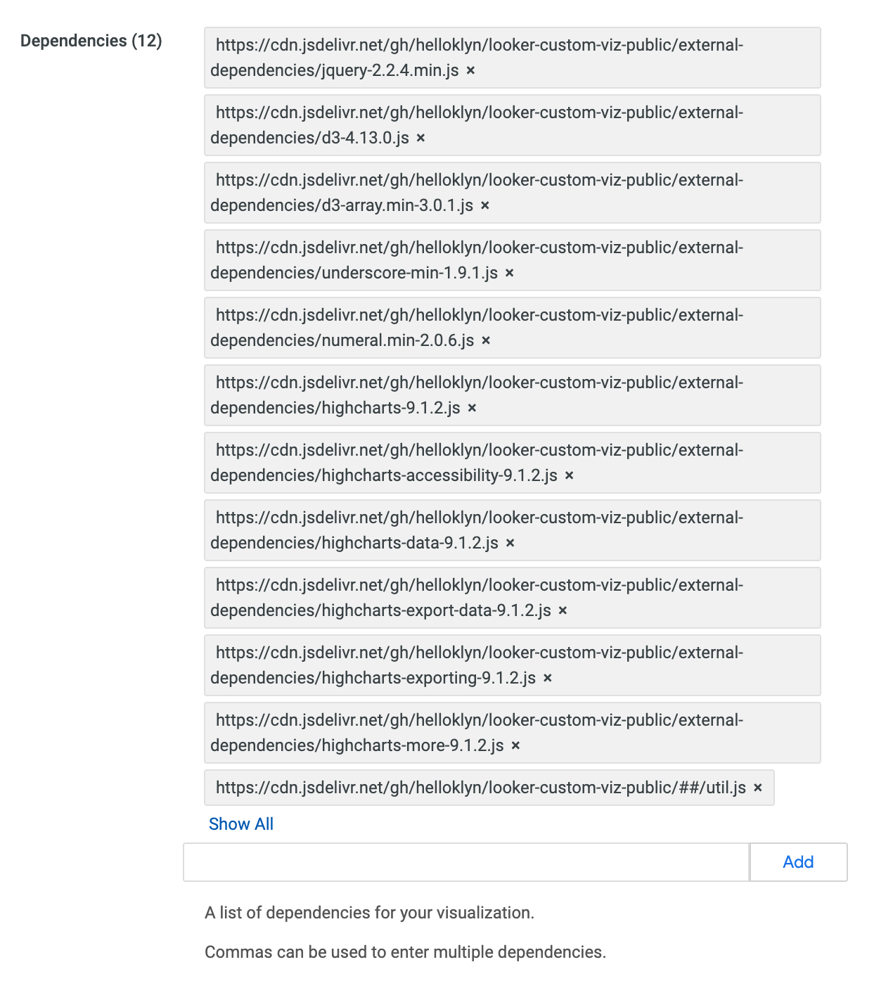

# Metrics as a Widget
# A repo of Looker Custom Viz Packages

## Instruction

added from Admin/Visualization Panel



Add main

e.g.: https://cdn.jsdelivr.net/gh/helloklyn/looker-custom-viz-public/##/main.js

Add Dependencies

```
https://cdn.jsdelivr.net/gh/helloklyn/looker-custom-viz-public/external-dependencies/jquery-2.2.4.min.js,
https://cdn.jsdelivr.net/gh/helloklyn/looker-custom-viz-public/external-dependencies/d3-4.13.0.js,
https://cdn.jsdelivr.net/gh/helloklyn/looker-custom-viz-public/external-dependencies/d3-array.min-3.0.1.js,
https://cdn.jsdelivr.net/gh/helloklyn/looker-custom-viz-public/external-dependencies/underscore-min-1.9.1.js,
https://cdn.jsdelivr.net/gh/helloklyn/looker-custom-viz-public/external-dependencies/numeral.min-2.0.6.js,
https://cdn.jsdelivr.net/gh/helloklyn/looker-custom-viz-public/external-dependencies/highcharts-9.1.2.js,
https://cdn.jsdelivr.net/gh/helloklyn/looker-custom-viz-public/external-dependencies/highcharts-accessibility-9.1.2.js,
https://cdn.jsdelivr.net/gh/helloklyn/looker-custom-viz-public/external-dependencies/highcharts-data-9.1.2.js,
https://cdn.jsdelivr.net/gh/helloklyn/looker-custom-viz-public/external-dependencies/highcharts-export-data-9.1.2.js,
https://cdn.jsdelivr.net/gh/helloklyn/looker-custom-viz-public/external-dependencies/highcharts-exporting-9.1.2.js,
https://cdn.jsdelivr.net/gh/helloklyn/looker-custom-viz-public/external-dependencies/highcharts-more-9.1.2.js,
https://cdn.jsdelivr.net/gh/helloklyn/looker-custom-viz-public/##/util.js
```




